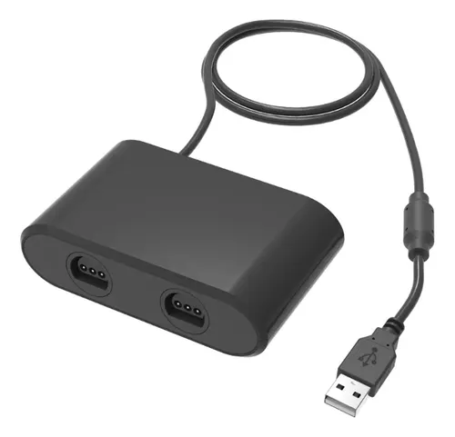

# HS-N6420 / `0079:1846` Linux HID Fix

> **A tiny, targeted Linux `usbhid` workaround that turns a stubborn N64 controller converter into real Linux input.**

[](https://kernel.org/)
[](https://usb-ids.gowdy.us/read/UD/0079/1846)
[](NOTICE)
[](LICENSE)

---

## The short version

This project exists because a cheap N64 controller converter produced a wonderfully annoying Linux problem:

```text
Linux sees the USB device.
Linux knows it is HID.
Linux knows the 0079:1846 device family.

...and then usbhid dies with -71.
```

The exact failure was:

```text
0079:1846 DragonRise Inc. GameCube Controller Adapter

usbhid 1-9:1.0: can't add hid device: -71
usbhid 1-9:1.0: probe with driver usbhid failed with error -71
```

The result was no usable controller device, no `evdev` input and nothing for Mupen64Plus to bind to.

We traced the failure into Linux's generic HID initialization path and built a deliberately narrow compatibility patch for **VID:PID `0079:1846`**. The patched module was tested with a real N64 controller and Mupen64Plus on Linux `6.14.0-37-generic`.

**It works.**

---

## The hardware that started this project

This is the actual adapter used for the investigation — **not a stock Mayflash product photo**:



The box identifies the unit as:

```text
N64 Controller Converter
Model: HS-N6420
```

The physical shell is a generic Chinese-market design. We are **not** claiming that every HS-N6420 is electrically identical to every Mayflash/DragonRise unit. What matters for this project is the USB identity observed from the working device:

```text
VID:PID       0079:1846
Manufacturer  mayflash limited
Product       GameCube Controller Adapter
```

The safest identification rule is therefore:

> **Do not identify the hardware by its plastic shell. Identify it by VID:PID and USB descriptors.**

The HS-N6420 model is the identification printed on the packaging of the tested unit. The Linux-side identity comes from the USB descriptors actually reported by that unit.

---

## What we actually observed

| Property | Observed / Tested value |
|---|---|
| USB VID:PID | `0079:1846` |
| USB database identity | DragonRise Inc. GameCube Controller Adapter |
| USB manufacturer string | `mayflash limited` |
| USB product string | `GameCube Controller Adapter` |
| Physical packaging | "N64 Controller Converter", Model: `HS-N6420` |
| USB version | 2.00 |
| HID version | 1.10 |
| Interface | HID class (`03`) |
| Interrupt IN endpoint | `0x81` / 37 bytes |
| OUT endpoint | `0x02` / 5 bytes |
| Report descriptor | 198 bytes before workaround |
| Kernel driver involved | `usbhid` (patched) + `hid_mf` |
| Successful Linux kernel | `6.14.0-37-generic` |
| Emulator tested | Mupen64Plus |
| Test ROM | *Super Mario 64* (USA) |
| Controller tested | Physical N64 controller (translucent green) |
| Functional result | Native input recognized, all buttons, stick, and corrected C-button camera controls verified |

The important point is that **HS-N6420 is a physical/product identifier, not a claim that the USB device is uniquely manufactured by Mayflash**. The tested hardware reports the Mayflash/DragonRise USB identity `0079:1846`.

---

# The story

This started as a completely ordinary retro-gaming task: get an N64 controller working on the Linux machine.

We plugged in the converter.

`lsusb` immediately saw it:

```text
Bus 001 Device 005: ID 0079:1846 DragonRise Inc. GameCube Controller Adapter
```

So far, so good.

Then Linux tried to initialize the HID interface and responded:

```text
usbhid 1-9:1.0: can't add hid device: -71
```

There was no controller in `/proc/bus/input/devices`. No joystick. No useful `evdev` stream. Mupen64Plus had nothing to work with.

We initially suspected the Mayflash driver. Linux already had `hid_mf`, though, and reloading it did nothing.

That was the turning point.

The failure was happening **before the normal HID device path could become useful**.

We went down into `usbhid`, inspected the actual USB descriptors, checked the kernel's existing `hid_mf` support and eventually isolated the device-specific initialization behavior that was killing enumeration.

The final workaround does three important things:

1. **Skip the broken HID `SET_IDLE` request** for this exact VID:PID.
2. **Reconstruct the four-port HID report description** when the known 198-byte descriptor is encountered.
3. **Force continuous HID polling** with `HID_QUIRK_ALWAYS_POLL`.

Then we built only the affected `usbhid.ko` module instead of rebuilding the entire Linux kernel.

And finally:

**the N64 controller worked.**

Not “Linux sees it.”

Not “maybe SDL can see it.”

The physical buttons, stick, C-buttons, Z, triggers, Start and D-pad generated real input and Mupen64Plus could use them.

We even caught and fixed a separate emulator-side mistake where the C-button axes were crossed, which made Mario's camera behave strangely. That was configuration, not a kernel problem.

That is the entire reason this repository exists: so the next person does not have to spend an evening repeating the same kernel archaeology.

---

# What actually failed?

The original USB enumeration succeeded, but generic HID initialization failed:

```text
USB device
    │
    ▼
usbhid initialization       ← failure here
    │
    X  -71
    │
    ▼
HID device registration
    │
    ▼
evdev / joystick / SDL2
    │
    ▼
Mupen64Plus
```

The observed initialization path showed that the adapter firmware did not behave correctly when Linux issued the standard HID `SET_IDLE` request. The resulting USB/HID error prevented the report descriptor from being consumed normally.

The device also exposes a report layout corresponding to four controller ports, while the initial descriptor observed by Linux was only 198 bytes. The compatibility code reconstructs the expected four-port layout and enables continuous polling.

This is why adding another generic controller mapping or merely reloading `hid_mf` was never going to solve the original problem.

---

# What the patch changes

The patch is intentionally small and device-specific. It modifies only:

```text
drivers/hid/usbhid/hid-core.c
```

The patch:

- skips `hid_set_idle()` for `0079:1846`;
- expands the known 198-byte report descriptor to 396 bytes;
- creates report IDs for the additional controller ports;
- enables `HID_QUIRK_ALWAYS_POLL`;
- applies the same `SET_IDLE` exception during post-reset recovery.

The actual patch is:

```text
patches/0001-mayflash-0079-1846-usbhid-fix.patch
```

This is **not a replacement for Linux's `hid_mf` driver**. Linux already knows this device family. This repository fixes the earlier initialization failure that prevented the normal HID stack from getting that far.

---

# Installation

You do **not** need to rebuild the entire Linux kernel.

The repository builds a replacement `usbhid.ko` against the running kernel's headers.

On Debian/Ubuntu-style systems:

```bash
sudo apt update
sudo apt install -y build-essential linux-headers-$(uname -r) patch curl
```

Clone the project:

```bash
git clone https://github.com/StudioSuiri/HS-N6420-0079-1846-Linux-HID-Patch.git
cd HS-N6420-0079-1846-Linux-HID-Patch
```

> GitHub redirects old repository URLs after a rename, so the original repository URL may continue to work for existing clones.

Build:

```bash
./scripts/build-module.sh
```

Install:

```bash
sudo ./scripts/install-module.sh
```

Verify:

```bash
./scripts/verify.sh
```

For a read-only diagnostic report:

```bash
./scripts/diagnose.sh
```

To remove the workaround and restore the stock module:

```bash
sudo ./scripts/uninstall-module.sh
```

### Important

The module is tied to the kernel release it was built for. After a kernel update, rebuild it.

```bash
uname -r
./scripts/build-module.sh
sudo ./scripts/install-module.sh
```

The patch is deliberately scoped to `0079:1846`. **Do not modify it to match another VID:PID unless you have evidence that the other hardware has the same failure and descriptor behavior.**

---

# Mupen64Plus / N64

Once the kernel problem is fixed, the N64 controller becomes ordinary Linux input. The emulator mapping is a separate layer.

The corrected C-button mapping was important for *Super Mario 64*:

```text
C-left   → axis(2-)
C-right  → axis(2+)
C-up     → axis(5-)
C-down   → axis(5+)
```

Full emulator notes live in:

```text
docs/mupen64plus.md
```

---

# Verification philosophy

There are three separate milestones:

### 1. USB sees the device

```bash
lsusb -d 0079:1846
```

### 2. Linux creates input devices

```bash
cat /proc/bus/input/devices
ls -l /dev/input/by-id/
```

### 3. Physical controls generate events

Use `scripts/verify.sh`, `evtest`, SDL2 tools or `python-evdev`.

**`lsusb` alone is not success.** The goal is the complete path from USB enumeration to actual controller events.

Also, do not hard-code `/dev/input/eventN` or `/dev/input/jsN`; those numbers are dynamic.

---

# Repository layout

```text
HS-N6420-0079-1846-Linux-HID-Patch/
├── README.md
├── LICENSE
├── NOTICE
├── SECURITY.md
├── CONTRIBUTING.md
├── patches/
│   └── 0001-mayflash-0079-1846-usbhid-fix.patch
├── src/
│   ├── Makefile
│   ├── hid-core.c
│   ├── hiddev.c
│   ├── hid-pidff.c
│   ├── hid-pidff.h
│   └── usbhid.h
├── scripts/
│   ├── build-module.sh
│   ├── diagnose.sh
│   ├── install-module.sh
│   ├── uninstall-module.sh
│   └── verify.sh
├── docs/
│   ├── mupen64plus.md
│   ├── troubleshooting.md
│   └── images/
│       └── hs-n6420-real.webp
└── tests/
    └── test_patch_format.sh
```

---

## Upstream status

This repository is an independent, experimentally verified workaround. It is not an official Linux kernel patch and has not been accepted upstream. The long-term goal is to provide enough reproducible evidence for a future upstream HID fix if kernel maintainers consider the behavior appropriate.

---

# Scope and limitations

This repository makes deliberately modest claims.

- Tested USB identity: **`0079:1846`**.
- Tested Linux kernel: **`6.14.0-37-generic`**.
- Tested host: x86_64 Linux with xHCI.
- Tested emulator: Mupen64Plus.
- Tested controller: physical translucent-green N64 controller.
- The physical adapter was sold as **N64 Controller Converter, Model: HS-N6420**.
- The USB descriptors reported `mayflash limited` / `GameCube Controller Adapter`.
- We do **not** claim that every HS-N6420, every clone, or every visually similar adapter is identical.
- Other kernel releases and distributions require verification.
- Build dependencies: The out-of-tree module compilation (`build-module.sh`) operates entirely offline against the bundled stock driver sources in `src/` and the local kernel development headers (`linux-headers-$(uname -r)`). No remote scripts, external binaries, or third-party code are downloaded at build time.


The project is intentionally conservative because a device-specific HID quirk should be based on observed USB behavior, not on a product photo or marketplace name.

---

# Upstream status

This repository is **not an upstream Linux kernel submission** and does not claim to be one.

The goal of publishing it is to make the failure reproducible and the workaround reviewable. If other users confirm the same behavior, or if a kernel developer determines that the quirk is appropriate for Linux, the patch can be refined and submitted through the normal Linux HID/kernel development process.

In particular, upstream review may determine that the current workaround is too broad, too specific to one firmware revision, or should be implemented differently. That is a feature of publishing the evidence rather than hiding the workaround in a private machine.

Useful evidence for future review includes:

- the exact `0079:1846` USB identity;
- the failing `usbhid` `-71` trace;
- the observed HID/report descriptors;
- the minimal device-specific patch;
- successful input-event verification;
- kernel versions on which the problem is reproduced or absent.

---

# Why publish this?

Because the problem is reproducible, the workaround is narrow, the code is reviewable, and the repository includes the actual kernel patch rather than only a mysterious binary.

Publishing the exact VID:PID, failure log, descriptor behavior, patch and verification path gives other Linux users something concrete to test — and gives kernel developers enough information to decide whether the workaround belongs upstream, needs refinement, or only applies to a particular firmware revision.

If somebody has the same `0079:1846` device and **does not** need this patch on a different kernel, that is valuable information too.

---

# Contributing

Useful contributions include:

- testing additional kernel versions;
- testing additional `0079:1846` revisions;
- comparing HID descriptors from working and failing units;
- testing Intel and AMD xHCI hosts;
- validating the workaround on other distributions;
- improving the module build/install flow;
- finding a cleaner upstreamable solution;
- documenting mappings for other emulators.

When opening an issue, include:

```text
uname -r
lsusb -d 0079:1846
./scripts/diagnose.sh
```

and the relevant `dmesg` output.

---

# The one-line version

> **A cheap Chinese N64 controller converter sold as HS-N6420 that Linux identified as `0079:1846` but refused to turn into a controller became fully usable after a tiny, device-specific `usbhid` compatibility patch — so we wrote down exactly how and why.**

---

## Credits and disclaimer

This is an independent community project born from real hardware debugging and verification.

It is **not affiliated with Mayflash, DragonRise, HONSON, Nintendo, Linux kernel maintainers or Mupen64Plus**.

The HS-N6420 model identification comes from the packaging supplied with the tested hardware; the Linux-side identification comes from the USB descriptors actually observed on that hardware.

The kernel patch is provided for testing and compatibility purposes. Review it before installing it on a production system, keep a rollback path, and rebuild it when your kernel changes.

## License

- Repository scripts and documentation: **MIT License** — see [`LICENSE`](LICENSE).
- Kernel patch: **GPL-2.0-only**, matching the applicable Linux kernel terms — see [`NOTICE`](NOTICE).
